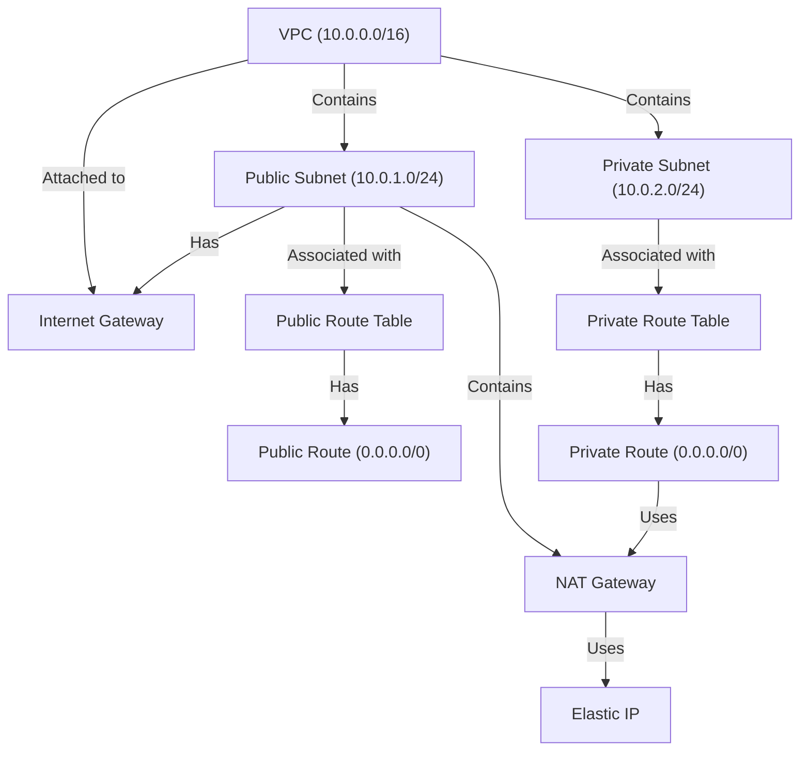

# Terraform Configuration

This Terraform script performs the following tasks:

- Creates a VPC (10.0.0.0/16)
- Defines one public subnet (10.0.1.0/24)
- Defines one private subnet (10.0.2.0/24)
- Creates an Internet Gateway (IGW) for the public subnet
- Creates an Elastic IP (EIP) and NAT Gateway for the private subnet
- Associates route tables correctly

## Instructions

### Start the Terraform Project

1. Initialize the Terraform working directory:

   ```sh
   terraform init
   ```

2. Review the Terraform execution plan:

   ```sh
   terraform plan
   ```

3. Apply the Terraform configuration to create the resources:
   ```sh
   terraform apply
   ```

### Destroy the Terraform Project

To destroy the resources created by this Terraform configuration, run the following command:

```sh
terraform destroy
```

## Diagram


