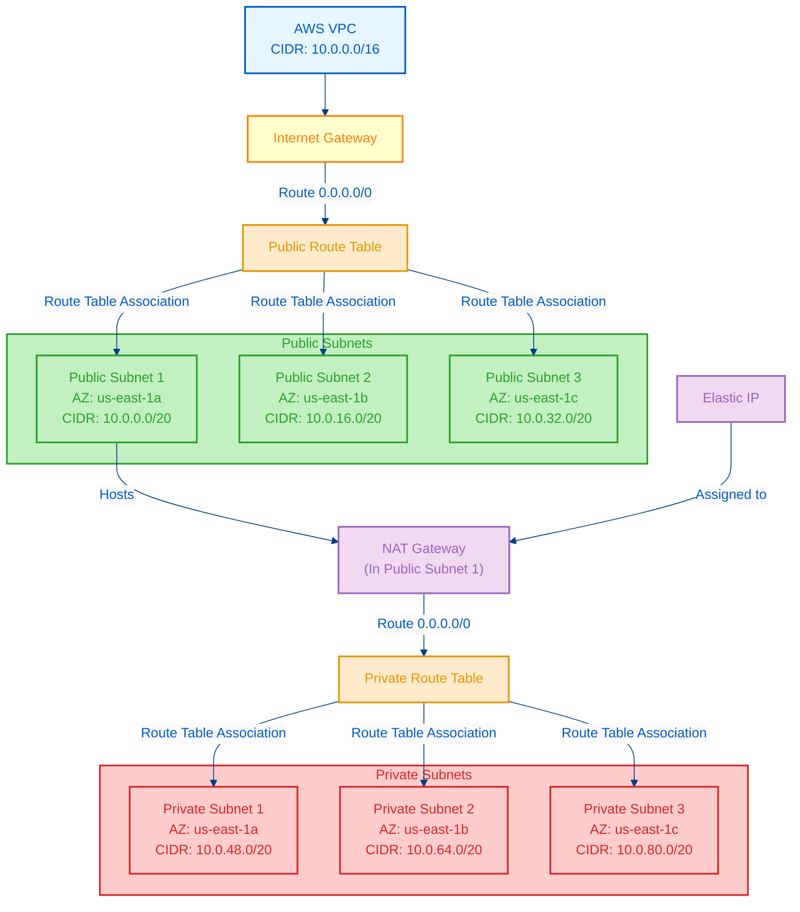

# AWS VPC Terraform Module

This Terraform module creates a complete Virtual Private Cloud (VPC) infrastructure on AWS including public and private subnets, internet gateway, NAT gateway, and all necessary route tables and associations.

## Architecture

The module creates the following resources:

- A VPC with configurable CIDR block
- Multiple public subnets across different availability zones
- Multiple private subnets across different availability zones
- Internet Gateway for public internet access
- NAT Gateway (optional) for private subnet outbound internet access
- Route tables for both public and private subnets
- All necessary route associations

## Instructions

### Start the Terraform Project

1. Initialize the Terraform working directory:

   ```sh
   terraform init
   ```

2. Review the Terraform execution plan:

   ```sh
   terraform plan
   ```

3. Apply the Terraform configuration to create the resources:
   ```sh
   terraform apply
   ```
4. After applying the configuration, you can view the output values (e.g., VPC ID, subnet IDs) with:
   ```sh
   terraform output
   ```

### Destroy the Terraform Project

To destroy the resources created by this Terraform configuration, run the following command:

```sh
terraform destroy
```

## Usage

```hcl
module "vpc" {
  source = "./modules/vpc/v1"

  vpc_name                      = "production-vpc"
  cidr_block                    = "10.0.0.0/16"
  enable_dns_support            = true
  enable_dns_hostnames          = true
  public_subnet_count           = 3
  public_subnet_additional_bits = 4
  private_subnet_count          = 3
  private_subnet_additional_bits = 4
  nat_gateway                   = true

  default_tags = {
    Environment = "production"
    Terraform   = "true"
    Project     = "my-project"
  }

  public_subnet_tags = {
    Tier = "public"
  }

  private_subnet_tags = {
    Tier = "private"
  }
}
```

## Requirements

| Name      | Version  |
| --------- | -------- |
| terraform | >= 1.0.0 |
| aws       | >= 4.0.0 |

## Inputs

| Name                           | Description                                    | Type          | Default         | Required |
| ------------------------------ | ---------------------------------------------- | ------------- | --------------- | :------: |
| nat_gateway                    | A boolean flag to deploy NAT Gateway.          | `bool`        | `false`         |    no    |
| vpc_name                       | Name of the VPC.                               | `string`      | `"my-vpc"`      |    no    |
| cidr_block                     | The IPv4 CIDR block for the VPC.               | `string`      | `"10.0.0.0/16"` |    no    |
| enable_dns_support             | Enable/disable DNS support in the VPC.         | `bool`        | `true`          |    no    |
| enable_dns_hostnames           | Enable/disable DNS hostnames in the VPC.       | `bool`        | `false`         |    no    |
| default_tags                   | A map of tags to add to all resources.         | `map(string)` | `{}`            |    no    |
| public_subnet_count            | Number of Public subnets.                      | `number`      | `3`             |    no    |
| public_subnet_additional_bits  | Number of additional bits for public subnets.  | `number`      | `4`             |    no    |
| public_subnet_tags             | A map of tags to add to all public subnets.    | `map(string)` | `{}`            |    no    |
| private_subnet_count           | Number of Private subnets.                     | `number`      | `3`             |    no    |
| private_subnet_additional_bits | Number of additional bits for private subnets. | `number`      | `4`             |    no    |
| private_subnet_tags            | A map of tags to add to all private subnets.   | `map(string)` | `{}`            |    no    |

## Outputs

| Name                     | Description                          |
| ------------------------ | ------------------------------------ |
| vpc_id                   | The ID of the VPC.                   |
| list_of_az               | List of availability zones.          |
| public_subnets           | List of public subnet IDs.           |
| private_subnets          | List of private subnet IDs.          |
| aws_internet_gateway     | The Internet Gateway.                |
| aws_route_table_public   | The ID of the public route table.    |
| aws_route_table_private  | The ID of the private route table.   |
| nat_gateway_ipv4_address | The IPv4 address of the NAT Gateway. |

## CIDR Calculation

This module uses Terraform's `cidrsubnet` function to automatically calculate subnet CIDR blocks:

- Public subnets use subnet numbers 0 to (public_subnet_count - 1)
- Private subnets use subnet numbers (public_subnet_count) to (public_subnet_count + private_subnet_count - 1)

## Network Diagram



## Traffic Flow

1. **Internet to Public Subnets**: Traffic flows from the internet through the Internet Gateway to resources in public subnets.

2. **Public Subnets to Internet**: Resources in public subnets use the Internet Gateway as their default route to send traffic to the internet.

3. **Private Subnets to Internet**: Resources in private subnets send outbound traffic through the NAT Gateway (which resides in a public subnet), which then forwards the traffic to the Internet Gateway.

4. **Internet to Private Subnets**: Direct inbound traffic from the internet to private subnets is not allowed. Traffic must first go through resources in the public subnets.

## Best Practices

- Use private subnets for databases, application servers, and other resources that don't need direct internet access
- Use public subnets for load balancers, bastion hosts, and other internet-facing resources
- Enable NAT Gateway only when resources in private subnets need outbound internet access
- Consider using multiple NAT Gateways (one per AZ) for high-availability production environments
